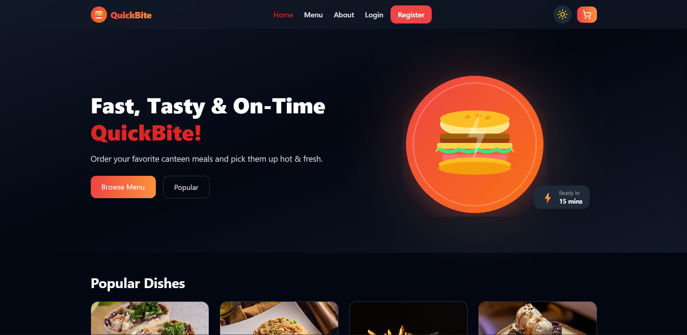

# 🍔 QuickBite - College Canteen Ordering System

**QuickBite** is a modern, full-stack web application designed to solve the problem of long queues at college canteens. It provides a seamless digital ordering experience, allowing students to order their favorite meals in advance and pick them up hot and fresh.

---

## ✨ Features

### Customer Features
- **Modern UI/UX**: Beautiful, responsive design featuring dark/light modes and smooth Framer Motion animations.
- **Full Menu Browsing**: Browse 100+ items across 9 categories (Pizza, Burger, South Indian, Drinks, etc.).
- **Smart Cart**: Add items to your cart with real-time total calculation.
- **Table Booking**: Reserve a table while placing your order (Visual indicator for occupied/available tables).
- **Authentication**: Secure email/password login + seamless **Google Sign-In**.
- **Order Tracking**: Track order status in real-time.
- **Contact Support**: Built-in contact form connected directly to customer support.

### Admin Features
- **Admin Dashboard**: Secure, dedicated portal for canteen staff.
- **Live Order Management**: Accept, prepare, and complete orders with real-time status updates.
- **Audio Notifications**: Alerts for new incoming orders.
- **Menu Management**: Easily update items, availability, and prices.

---

## 💻 Tech Stack

### Frontend
- **Framework**: React.js (Create React App)
- **Styling**: Tailwind CSS, Vanilla CSS
- **Routing**: React Router DOM
- **Animations**: Framer Motion
- **Icons**: Lucide React
- **State Management**: React Context API
- **Auth**: Google Identity Services

### Backend
- **Framework**: Java Spring Boot (3.2.2)
- **Database**: MySQL
- **ORM**: Hibernate / Spring Data JPA
- **Security**: Spring Security with JWT Authentication
- **Email**: JavaMailSender (for contact forms & notifications)

---

## 🚀 Getting Started (Local Development)

### 1. Backend Setup (Java Spring Boot)
1. Ensure you have **Java 17** and **MySQL** installed.
2. Create a local MySQL database named `quickbite_db`.
3. Open the `backend-java` folder.
4. Copy `.env.example` to `.env` and fill in your credentials.
5. Run the application:
   ```bash
   mvn spring-boot:run
   ```
*(The backend runs on `http://localhost:5000` and automatically populates the database with 100 seeded menu items on first start).*

### 2. Frontend Setup (React)
1. Ensure you have **Node.js** installed.
2. Open the `frontend` folder in a new terminal.
3. Install dependencies:
   ```bash
   npm install
   ```
4. Start the development server:
   ```bash
   npm start
   ```
*(The frontend runs on `http://localhost:3000`).*

---

## 📸 Screenshots



---

## 🧑‍💻 Team Profile
Built by engineering students to optimize the campus dining experience.
- Full Stack Development
- UI/UX Design
- Backend Engineering

---

<p align="center">Made with ❤️ for hungry students.</p>
